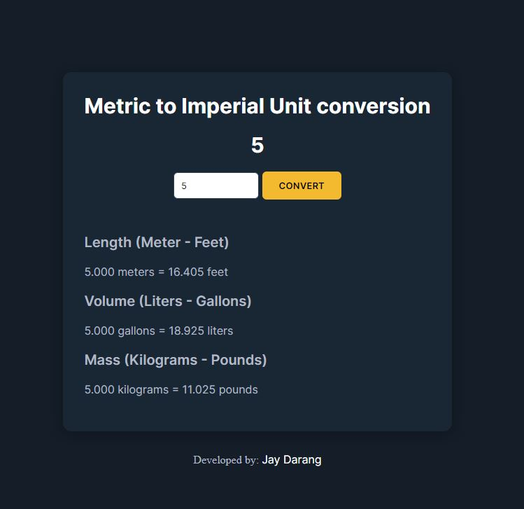

# Unit Converter



The Unit Converter is a web application that converts various units from the metric system to the imperial system.

## Live Application

The live version of the application can be found [here](https://jaydarang.github.io/Unit-converter/).

## Features

- Convert length (Meter - Feet)
- Convert volume (Liters - Gallons)
- Convert mass (Kilograms - Pounds)

## Technology Used

This application was created with:

- HTML5
- CSS3
- JavaScript

## Installation

To set up the project on your local machine, follow these steps:

1. Clone the repository to your machine
    ```
    git clone https://github.com/jaydarang/Unit-converter.git
    ```
    
2. Navigate to the project directory
    ```
    cd unit-converter
    ```

3. Open the `index.html` file in your preferred web browser.

## Usage

To use the Unit Converter:

1. Enter a value in the input box.
2. Click the `Convert` button.
3. The converted values for length, volume, and mass will be displayed below.
